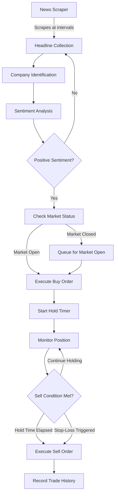

# Temporary Notes and To-do's
- We need to figure out some way to generate the generic "how much money we have" plot on our own. Alpaca may have some utility for this to make it easier. We can probably make another simple service for gathering this data and use the alpaca client singleton
- Test the stock sell for a price and see if you need the time limit to be a day (similar to when you buy a stock for a price)

I need a way to tell when a purchase order has actually been fullfilled. Basically when we submit an order, we probably need to log the information we get back in some service. Then we need to check the id of those orders to see when they are actually fullfilled. When they are full filled, that's when we can log that we need to sell the stock. 

# TrendLine

**Automated News-Driven Stock Trading System**

---

## Overview

TrendLine is an automated trading system that monitors financial news in real-time and executes stock trades based on sentiment analysis. The system mimics the decision-making process of a human trader who buys stocks on positive news and sells on negative news, but operates continuously and systematically during market hours.

### Key Capabilities

- **Automated News Monitoring**: Continuously scrapes financial news from reliable, pre-configured sources
- **Sentiment Analysis**: Analyzes headlines to determine market sentiment for specific companies
- **Intelligent Trading**: Executes buy/sell orders based on sentiment signals and configurable rules
- **Risk Management**: Implements stop-loss mechanisms and position limits to protect capital
- **Real-Time Visualization**: Provides interactive dashboards to monitor portfolio performance and active positions

---

## How It Works

### Workflow Steps

1. **News Collection**: The scraper monitors pre-determined reliable news sources at regular intervals (e.g., every 10 minutes)

2. **Company Identification**: Natural Language Processing (NLP) extracts company names from headlines and resolves them to stock ticker symbols using a database of publicly traded companies

3. **Sentiment Analysis**: Each headline is analyzed to determine sentiment (positive, negative, or neutral). Multiple headlines for the same company are averaged to produce an aggregate sentiment score

4. **Trade Execution**: 
   - **Buy Signal**: Positive sentiment triggers a buy order for a fixed dollar amount
   - **Market Timing**: If the market is closed, the order is queued for execution at market open
   - **Hold Period**: After purchase, the position is held for a configurable duration
   - **Sell Signal**: Positions are sold after the hold period expires or if stop-loss conditions are met

5. **Data Recording**: All trades, headlines, and decisions are logged for traceability and analysis

---

## Core Features

### News Scraping System
- Monitors multiple reliable news sources continuously
- Configurable scraping intervals
- Operates 24/7 with market-aware logic
- Handles duplicate detection across sources

### Sentiment Analysis Engine
- Analyzes headlines for company-specific sentiment
- Aggregates multiple headlines for the same company
- Distinguishes between company references and ambiguous terms (e.g., "Apple" the company vs. the fruit)

### Trading Automation
- Executes trades based on sentiment signals
- Handles market open/close transitions
- Supports partial share purchases
- Queues orders when market is closed

### Risk Management
- **Position Limits**: Configurable caps on total investment and per-company exposure
- **Stop-Loss Protection**: Automatic sell triggers if losses exceed threshold
- **Misclassification Protection**: Guards against false positive sentiment signals

### Visualization Dashboard
- Interactive Plotly line chart showing portfolio value over time
- Real-time table of active positions with profit/loss indicators
- Built with Streamlit for easy web access

---

## Trading Strategy

### Buy Conditions
- Positive sentiment detected in news headline
- Company successfully identified and ticker resolved
- Investment limits not exceeded
- Market is open (or order queued for next open)

### Sell Conditions
- **Time-Based**: Hold period has elapsed (configurable duration)
- **Stop-Loss**: Position loss exceeds configured threshold
- **Market Close**: If hold period extends past market close, sell at close or next market open

### Position Management
- **Fixed Investment Amount**: Each buy uses a predetermined dollar amount (supports fractional shares)
- **Duplicate Handling**: 
  - Same headline from different sources: Average sentiments
  - Same headline from same source: Discard duplicate
- **Multiple Headlines**: Aggregate sentiment across all headlines for a company

---

## Configuration Options

The system provides flexible configuration for various parameters:

| Parameter | Description | Example |
|-----------|-------------|---------|
| **Scraping Interval** | Frequency of news checks | 10 minutes |
| **Hold Duration** | Time to hold positions before selling | 2 hours |
| **Investment Amount** | Fixed dollar amount per trade | $100 |
| **Total Investment Cap** | Maximum total portfolio value | $10,000 |
| **Per-Company Cap** | Maximum investment per company | $1,000 |
| **Stop-Loss Threshold** | Loss percentage triggering automatic sell | 5% |
| **News Sources** | List of reliable news websites to monitor | Configurable list |

---

## Technical Architecture

### Components

1. **News Scraper**
   - Continuously monitors configured news sources
   - Extracts headlines and metadata
   - Implements rate limiting and error handling

2. **Company Identification Module**
   - NLP-based entity extraction from headlines
   - Ticker symbol resolution via public company database
   - Ambiguity resolution (company vs. non-company references)

3. **Sentiment Analysis Engine**
   - Headline sentiment classification
   - Multi-headline aggregation
   - Confidence scoring

4. **Trading Engine**
   - Market status monitoring
   - Order execution and queuing
   - Position tracking
   - Stop-loss monitoring

5. **Data Storage**
   - **Trade History Database**: Records all executed trades with timestamps, prices, and outcomes
   - **Headline Archive**: Stores scraped headlines (decision pending: all headlines vs. only those triggering trades)
   - **Logging System**: Comprehensive logging for traceability and debugging

6. **Visualization Dashboard**
   - Streamlit web application
   - Real-time portfolio performance charts
   - Active position monitoring
   - Historical trade analysis

---

## Data Management

### Trade History
- All buy and sell transactions recorded with:
  - Timestamp
  - Company/ticker
  - Quantity and price
  - Sentiment score
  - Profit/loss
  - Triggering headline(s)

### Headline Archival
- Scraped headlines stored with:
  - Source URL
  - Timestamp
  - Extracted company
  - Sentiment score
  - Whether it triggered a trade

### Logging
- Comprehensive logging throughout the system for:
  - Debugging and troubleshooting
  - Audit trail of decisions
  - Performance monitoring
  - Error tracking

---

## Future Enhancements

### Advanced Selling Algorithms
- Move beyond fixed hold periods to dynamic selling strategies
- Incorporate technical indicators
- Implement trailing stop-losses

### Confidence-Based Position Sizing
- Vary investment amount based on sentiment confidence
- Higher confidence = larger position size

### Pre-Market and After-Hours Trading
- Research and implement extended hours trading
- Understand access requirements and limitations

### Enhanced NLP Capabilities
- Improve company identification accuracy
- Better handling of ambiguous references
- Multi-language support

### Additional Risk Controls
- Portfolio diversification rules
- Sector exposure limits
- Volatility-based position sizing

---