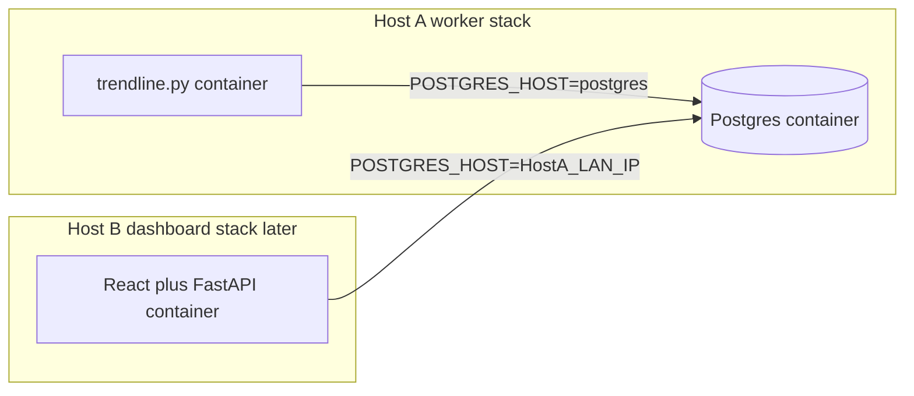
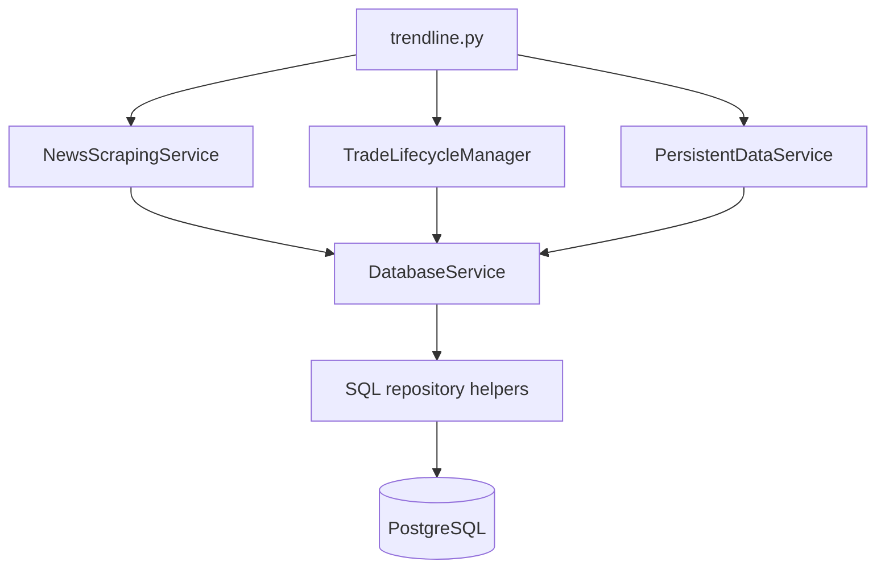

# DB Migration Plan for trendline.py

Replace pickle snapshots with PostgreSQL (schema from [relational_schema.md](relational_schema.md)) for `trendline.py` and its dependencies, using write-through singleton DB services, a one-time pickle→SQL migrator, migrate all config/secrets from `.streamlit/secrets.toml` to `.env`, local Postgres for testing, and a production Compose stack that co-locates `trendline.py` with Postgres while publishing the DB for a future LAN dashboard on another server.

Schema source of truth: [relational_schema.md](relational_schema.md). Today’s pickle coordinator is [`src/persistent_data_service.py`](../src/persistent_data_service.py) — it will be replaced, not extended with SQL inside the pickle writer.

**Out of scope:** Streamlit dashboard ([`trendline_streamlit.py`](../trendline_streamlit.py), [`src/front_end/`](../src/front_end/)). Leave pickle readers there broken/stale until the future React + FastAPI app; do not migrate `trade_snapshot_loader.py` in this work.

**Locked defaults:**

- Include a one-time pickle→Postgres migrator
- Native local Postgres for testing
- Docker Compose for production (worker + DB co-located on Host A)
- Future dashboard on Host B connects over LAN to Host A Postgres
- Migrate **all** config/secrets from `.streamlit/secrets.toml` to `.env`

## Implementation checklist

- [ ] Migrate all secrets/config from `.streamlit/secrets.toml` to `.env`; refactor `src/configs.py` to use `python-dotenv`; add `.env.example`; stop reading `secrets.toml`
- [ ] Add `psycopg`, Postgres `.env` vars, local install notes, and `docker-compose.worker.yml` (trendline + Postgres) with Postgres published for LAN dashboard clients
- [ ] Create `sql/schema.sql` + `scripts/apply_schema.py` from [relational_schema.md](relational_schema.md)
- [ ] Implement `DatabaseService` singleton + repository/mapper SQL layer under `src/database/`
- [ ] Refactor `NewsScrapingService`: insert articles at discovery; drop `served_articles` + pickle snapshot APIs
- [ ] Refactor `TradeLifecycleManager` to write-through SQL; drop in-memory durable indexes/lists
- [ ] Rewrite `PersistentDataService` + `trendline.py` startup/resume/shutdown; remove flush saves
- [ ] Implement `scripts/migrate_pickle_to_postgres.py` with dry-run and verification counts
- [ ] Rewrite/add unittest coverage for DB repos, services, migrator; run full test suite against local Postgres

---

## 0. Config migration: `secrets.toml` → `.env`

Today [`src/configs.py`](../src/configs.py) loads Alpaca/HF keys via `tomllib` from [`.streamlit/secrets.toml`](../.streamlit/secrets.toml). That file is the **only** secrets consumer in Python (no `st.secrets` usage elsewhere). Migrate fully to `.env` as part of this work — including existing keys, not only new Postgres vars.

### 0.1 Python package

Add to [`requirements.txt`](../requirements.txt):

```text
python-dotenv>=1.0.0
```

### 0.2 Files

| File | Action |
|------|--------|
| [`.env`](../.env) | Create locally (gitignored — already in [`.gitignore`](../.gitignore)); copy values from current `secrets.toml` + new `POSTGRES_*` |
| [`.env.example`](../.env.example) | Commit with **placeholder** values only (no real keys) |
| [`.streamlit/secrets.toml`](../.streamlit/secrets.toml) | Stop reading in code; after cutover, delete or leave as unused backup (operator choice). Keep gitignore entry. |
| [`src/configs.py`](../src/configs.py) | Refactor loader (below) |
| [relational_schema.md](relational_schema.md) | When touching docs, change “secrets.toml” wording to `.env` |

### 0.3 `.env.example` keys (canonical list)

```bash
# Alpaca
ALPACA_API_ID=
ALPACA_SECRET_KEY=
ALPACA_API_ID_PAPER=
ALPACA_SECRET_KEY_PAPER=
USE_PAPER=1

# Optional / legacy
HF_TOKEN=

# Postgres
POSTGRES_HOST=localhost
POSTGRES_PORT=5432
POSTGRES_DB=trendline
POSTGRES_USER=trendline
POSTGRES_PASSWORD=

# Ollama (already env-overridable today; document here for one place)
OLLAMA_MODEL=llama3.1
OLLAMA_MAX_ATTEMPTS=3
OLLAMA_RETRY_BACKOFF_SECONDS=0.75
OLLAMA_TIMEOUT_SECONDS=
OLLAMA_WARMUP_ON_STARTUP=1
```

Operator migration steps (document in README / `docs/postgres_setup.md`):

```bash
cp .env.example .env
# Paste values from .streamlit/secrets.toml into .env
# Add POSTGRES_* for local or Docker
```

### 0.4 Refactor [`src/configs.py`](../src/configs.py)

**Remove:**

- `import tomllib`
- Opening/reading `.streamlit/secrets.toml`
- Module-level `config = tomllib.load(...)`

**Add:**

```python
from dotenv import load_dotenv

# Load project-root .env once at import. override=False so real process env
# (Docker Compose, systemd, CI) wins over file values.
load_dotenv(dotenv_path=Path(__file__).resolve().parents[1] / ".env", override=False)
```

Then define every setting from `os.environ` / `os.getenv` with clear required vs optional behavior:

| Variable | Required? | Notes |
|----------|-----------|--------|
| `ALPACA_API_ID`, `ALPACA_SECRET_KEY`, `ALPACA_API_ID_PAPER`, `ALPACA_SECRET_KEY_PAPER` | Yes for live trading paths | Fail fast with a clear error if missing when imported (or when selecting paper/live pair) |
| `USE_PAPER` | No (default `1` / true) | Parse like existing Ollama bools (`0`/`false` → False) |
| `HF_TOKEN` | No | Currently loaded but unused elsewhere; keep optional for compatibility |
| `POSTGRES_*` | Yes for DB-backed runtime | Fail fast in `DatabaseService.open()` if missing |
| `OLLAMA_*` | No | Keep current defaults |

Keep exporting the same public names so call sites need little or no change:

- `ALPACA_CHOSEN_SECRET_KEY`, `ALPACA_CHOSEN_API_ID`, `USE_PAPER`
- `HF_TOKEN` (optional empty string)
- New: `POSTGRES_HOST`, `POSTGRES_PORT`, `POSTGRES_DB`, `POSTGRES_USER`, `POSTGRES_PASSWORD`, and/or `POSTGRES_DSN`

**Helper (recommended):** small `_require_env(name: str) -> str` that raises `RuntimeError(f"Missing required env var: {name}")` so missing `.env` is obvious.

**Path note:** resolve `.env` relative to **project root** (parent of `src/`), not CWD, so `python trendline.py` and `python -m unittest` behave the same regardless of launch directory. Docker should still inject env via Compose `env_file: .env` (process env wins because `override=False`).

### 0.5 Call sites / refactoring scope

| Location | Change |
|----------|--------|
| [`src/configs.py`](../src/configs.py) | Primary rewrite (above) |
| [`src/base/alpaca_client.py`](../src/base/alpaca_client.py) | No API change if exports stay the same |
| [`src/trader.py`](../src/trader.py) | No change |
| Tests importing `ALPACA_*` from configs | Ensure `.env` exists in dev/CI **or** tests set env in `setUp` / use a committed `.env.test` loaded only under test — prefer documenting “copy `.env.example` → `.env`” for local runs |
| Streamlit entry [`trendline_streamlit.py`](../trendline_streamlit.py) | Out of scope for UI migration, but it imports code that imports `configs` — once `configs.py` uses dotenv, Streamlit picks up `.env` automatically without `secrets.toml`. No need to keep a Streamlit-specific secrets file for Alpaca. |
| Docker `trendline` service | `env_file: .env` (or explicit `environment:`) so containers get the same vars |

### 0.6 Acceptance for env cutover

- No Python code opens `.streamlit/secrets.toml`.
- `tomllib` unused for secrets (can remove import).
- Fresh clone + filled `.env` from `.env.example` is enough to run tests/app (plus local/Docker Postgres).
- Real secrets never appear in `.env.example` or git.

---

## 1. Prerequisites

### 1.1 Python packages

Add to [`requirements.txt`](../requirements.txt):

```text
psycopg[binary]>=3.1.0
python-dotenv>=1.0.0
```

(`psycopg` is psycopg3. The `[binary]` extra avoids needing a local libpq build toolchain on most Linux boxes.)

Install into the existing venv:

```bash
source .venv/bin/activate
pip install -r requirements.txt
```

Remove `filelock` from *runtime* usage for domain persistence after migration (can leave the dependency if logging or anything else still needs it; today it is only used by pickle persistence).

### 1.2 Local PostgreSQL (testing / development)

On this RHEL/EL-style host (example):

```bash
sudo dnf install -y postgresql-server postgresql
sudo postgresql-setup --initdb   # once
sudo systemctl enable --now postgresql
sudo -u postgres createuser -P trendline   # set a password
sudo -u postgres createdb -O trendline trendline
```

Confirm:

```bash
psql -h localhost -U trendline -d trendline -c 'SELECT version();'
```

If peer auth blocks password login, adjust `pg_hba.conf` for local TCP (`scram-sha-256` for `127.0.0.1/32`) and reload Postgres. Document the exact `pg_hba.conf` tweak in a short `docs/postgres_setup.md` (or README section) when implementing.

### 1.3 Docker Compose (production) — worker + DB on one host

Intended production topology (confirmed):

- **Host A / Compose stack 1:** `trendline.py` **and** Postgres together
- **Host B / Compose stack 2 (later):** React + FastAPI dashboard, connecting **over the LAN** to Postgres on Host A

Add new files (none exist today):

- [`docker-compose.worker.yml`](../docker-compose.worker.yml) — two services on the same host:
  - `postgres` (`postgres:16`, named volume, **publish `5432` to the host LAN interface**)
  - `trendline` (runs `trendline.py`; `POSTGRES_HOST=postgres` via Compose DNS on the internal network)
- [`.env.example`](../.env.example) — all secrets including `POSTGRES_*` (never commit real secrets)
- Later (not in this migration): `docker-compose.dashboard.yml` on the other server

Bring the worker stack up with:

```bash
docker compose -f docker-compose.worker.yml --env-file .env up -d
```

Schema apply is via `psql -f sql/schema.sql` or `scripts/apply_schema.py` against Host A’s published Postgres port (from the host or from inside the network).

**Inside Host A:** the `trendline` service should use Compose service name `postgres` as `POSTGRES_HOST` (private Docker network).

**From Host B (dashboard later):** use Host A’s LAN IP/hostname as `POSTGRES_HOST` (e.g. `192.168.1.50`), not the Docker service name — Compose DNS does not cross machines.

### 1.4 Connection config (must be host-agnostic)

Postgres settings live in the same `.env` as Alpaca keys (see §0). Typical values:

| Key | Example |
|-----|---------|
| `POSTGRES_HOST` | `postgres` (worker container on same Compose network) / `localhost` (native local testing) / `192.168.x.x` (dashboard on LAN) |
| `POSTGRES_PORT` | `5432` |
| `POSTGRES_DB` | `trendline` |
| `POSTGRES_USER` | `trendline` |
| `POSTGRES_PASSWORD` | `...` |

[`src/configs.py`](../src/configs.py) exposes these (and optionally a built `POSTGRES_DSN`) for `DatabaseService`.

**Hard rule for implementers:** never hardcode the DB host inside `DatabaseService` or repositories. Host comes only from `.env` / process env.

### 1.5 Future LAN dashboard (prep now, build later)



- **Shared contract = the Postgres schema + DSN over the LAN**, not a shared filesystem and not pickle files.
- Dashboard does not need to talk to the worker process — it reads the same DB the worker writes.
- Publishing `5432` on Host A is what makes the remote dashboard possible; restrict it to the LAN / dashboard host via firewall and `pg_hba.conf`.

**Prep required in this migration (do these now):**

1. Ship `docker-compose.worker.yml` with **both** `postgres` and `trendline`, and **publish Postgres `5432`** on the host (not `127.0.0.1`-only bind if you want LAN access — use a LAN-safe publish + firewall).
2. Worker container uses internal `POSTGRES_HOST=postgres`; document that the future dashboard uses Host A’s LAN address.
3. All DB access via `POSTGRES_*` config/env (above).
4. Keep all SQL behind `src/database/` repositories so the future FastAPI app can reuse the same access layer.
5. Document in `docs/postgres_setup.md` (or README): LAN firewall allowlist for Host B → Host A:5432; `pg_hba.conf` / Postgres image auth for remote scram connections; do not expose 5432 to the public internet.

**Explicitly defer (do not build now):**

- `docker-compose.dashboard.yml` and the React/FastAPI app
- TLS for Postgres, PgBouncer, moving DB onto a third host
- Any worker↔dashboard application API — DB is the integration point

---

## 2. Target architecture



**Design rules:**

1. **Singleton everywhere** — match [`SingletonMeta`](../src/base/singleton.py) used by existing services.
2. **Write-through, not flush snapshots** — each domain mutation commits SQL immediately. End-of-loop `save_all(reason="flush")` and shutdown pickle saves go away (or become no-ops / connection cleanup only).
3. **DB is source of truth** — do **not** keep growing `archived_entries` / `served_articles` / `ready_to_sell` lists in memory as the durable store. Keep only:
   - RSS etag/modified + latest feed payloads in `NewsScrapingService` (process lifetime)
   - Optional small caches if needed for the current loop iteration
4. **Plain SQL + psycopg3** — no ORM. SQL lives in one place (see below), not scattered in `trendline.py`.
5. **Pipeline change** (from schema doc): insert `articles` at discovery; dedupe = PK existence; resume unfinished work with `sentiment_analyzed_at IS NULL`.

---

## 3. New files to create

| Path | Role |
|------|------|
| `sql/schema.sql` | Exact DDL from [relational_schema.md](relational_schema.md) (tables + indexes) |
| `sql/seed_news_sources.sql` | Optional seed; or seed from Python using `RSS_FEED_URLS` |
| `src/database/__init__.py` | Package marker |
| `src/database/db_service.py` | `DatabaseService(metaclass=SingletonMeta)` — pool, `connect()`, `execute`, transactions |
| `src/database/repositories.py` | All domain SQL (articles, sentiments, orders, sources) |
| `src/database/order_mapper.py` | Alpaca `Order` ↔ row / JSONB helpers |
| `src/database/rss_mapper.py` | feedparser entry ↔ `raw_entry` JSONB + projected columns |
| `scripts/apply_schema.py` | Apply `sql/schema.sql` + seed `news_sources` |
| `scripts/migrate_pickle_to_postgres.py` | One-time pickle → SQL |
| `docker-compose.worker.yml` | Production: `trendline` + `postgres` on one host; Postgres port published for LAN dashboard later |
| `.env` / `.env.example` | All secrets and Postgres/Ollama settings (see §0) |
| `tests/test_db_*.py` | Repository + integration tests (local Postgres or skip if unavailable) |

Keep SQL strings in `repositories.py` (or sibling modules under `src/database/`) so `TradeLifecycleManager` / `NewsScrapingService` call methods like `repo.insert_article(...)`, never embed SQL.

---

## 4. `DatabaseService` singleton (connection layer)

File: `src/database/db_service.py`

Responsibilities:

- Own a `psycopg_pool.ConnectionPool` **or** a simple long-lived connection if you want minimal deps (prefer `psycopg_pool` from `psycopg[pool]` / document adding `psycopg[binary,pool]`).
- API sketch:

```python
class DatabaseService(metaclass=SingletonMeta):
    def __init__(self) -> None: ...
    def open(self) -> None: ...          # create pool from configs
    def close(self) -> None: ...
    def connection(self): ...            # context manager yielding conn
    def execute(self, sql, params=None): ...
    def executemany(self, sql, seq): ...
    def fetch_all / fetch_one / fetch_val: ...
    def transaction(self): ...           # context manager BEGIN/COMMIT/ROLLBACK
```

- On first `open()`, optionally verify connectivity with `SELECT 1`.
- Threading: main loop is single-threaded today; still use a small pool (e.g. 1–4) so tests and future FastAPI can share the pattern.

---

## 5. Repository API (SQL abstraction)

File: `src/database/repositories.py` (can split later if large)

Implement these methods explicitly (names can vary slightly, but coverage must match):

### news_sources

- `upsert_news_sources(feeds: dict[str, str])` — seed/sync from `RSS_FEED_URLS`
- `list_active_news_sources() -> list[tuple[name, url]]`

### articles

- `article_exists(article_id: str) -> bool`
- `insert_article_at_discovery(source_name, entry) -> bool` — INSERT … ON CONFLICT DO NOTHING; returns whether inserted
- `list_pending_sentiment_articles() -> list[rows]` — `WHERE sentiment_analyzed_at IS NULL` ORDER BY `archived_at`
- `mark_sentiment_analyzed(article_id, raw_response, format_match, analyzed_at)`
- `set_resulted_in_purchase(article_id, True)`

### sentiments

- `insert_sentiments(article_id, rows: list[SentimentRow])` — one row per ticker; `UNIQUE(article_id, ticker)`
- `get_sentiment_id(article_id, ticker) -> int | None`

### buy_orders / sell_orders

- `insert_buy_order(order, article_id, sentiment_id)`
- `insert_sell_order(sell_order, buy_order_id)`
- `update_buy_order_from_alpaca(order)` / `update_sell_order_from_alpaca(order)` — status, fills, timestamps, `raw_order`, `is_terminal`
- `list_open_buy_orders() -> list[rows]` — `NOT is_terminal`
- `list_open_sell_orders() -> list[rows]`
- `list_ready_to_sell(hold_interval) -> list[rows]` — SQL from schema doc (anti-join + `filled_at <= now() - hold`)
- `mark_buy_terminal(alpaca_order_id)`

### Order / RSS mapping helpers

- Serialize Alpaca `Order` to column dict + `raw_order` JSONB (`model_dump(mode="json")` if available, else manual).
- Serialize feedparser entry to JSON-safe dict for `raw_entry` (walk nested structures; convert non-JSON types to str).
- Parse `published` / `published_parsed` into `published_at` TIMESTAMPTZ when possible.

---

## 6. Refactor domain services

### 6.1 Replace pickle `PersistentDataService`

Rewrite [`src/persistent_data_service.py`](../src/persistent_data_service.py) to a thin startup/shutdown coordinator:

| Old | New |
|-----|-----|
| `load_all()` pickle restore | `load_all()` → `DatabaseService().open()`; `upsert_news_sources(RSS_FEED_URLS)`; optionally tell news scraper which feeds are active |
| `save_all(flush)` full pickle dump | **Remove** routine flush, or make it a no-op that logs once at DEBUG |
| `save_all(shutdown)` | `close()` pool; no domain dump |

Update [`trendline.py`](../trendline.py):

- Keep `persistent_data.load_all()` at startup.
- **Delete** `persistent_data.save_all(reason="flush")` at end of loop.
- Change atexit/signal handlers to `DatabaseService().close()` (via `PersistentDataService.shutdown()` wrapper if you want a single façade).

### 6.2 `NewsScrapingService` ([`src/news_scraper.py`](../src/news_scraper.py))

**Remove:**

- `served_articles` set
- `get_persistent_snapshot` / `restore_from_persistent_snapshot`
- Marking articles served inside `get_unserved_articles`

**Change behavior:**

1. On init / after DB open: load active feeds from DB (fallback: `RSS_FEED_URLS`).
2. Keep `news_data` + etag/modified **in memory only** (as schema doc requires).
3. Replace `get_unserved_articles()` with something like `discover_new_articles()`:
   - For each feed entry with a link:
     - If `article_exists(link)`: skip
     - Else `insert_article_at_discovery(source, entry)` and yield `(source_name, entry)` **only for newly inserted rows**
4. Empty title handling stays in `trendline.py` (still insert at discovery — title may be null; loop can skip sentiment or mark analyzed with empty response — pick one rule and document it: **recommended:** insert always; if no title, `mark_sentiment_analyzed` with empty/`format_match=False` so it is not retried forever).

### 6.3 `TradeLifecycleManager` ([`src/trade_lifecycle_manager.py`](../src/trade_lifecycle_manager.py))

**Remove as durable state:**

- `archived_entries`, `_article_id_index`, `_buy_order_id_index`, `ready_to_sell`
- `get_persistent_snapshot` / `restore_from_persistent_snapshot`

**Rewrite methods to use repositories:**

| Method | New behavior |
|--------|----------------|
| `archive_news_entry(...)` | Article already inserted at discovery. Write sentiment metadata on `articles`; expand tickers → `sentiments` rows; insert `buy_orders`; set `resulted_in_purchase`; set `sentiment_analyzed_at`. Use a **single transaction**. |
| `log_sell_order(buy, sell)` | `insert_sell_order`; no in-memory dict update |
| `update()` | Load open buys/sells from DB; refresh each via Alpaca `get_order_by_id`; `UPDATE` row + `is_terminal` when status terminal / hold elapsed |
| `check_ready_to_sell()` | Query `list_ready_to_sell(MARKET_HOLD_TIME)`; hydrate to Alpaca `Order` objects (from `raw_order` JSONB or columns) for `stock_trader.sell` |
| `clear_ready_to_sell()` | No-op or mark buys terminal **only after** successful sell logging (prefer: `update()` marks terminal when hold elapsed *or* after sell is inserted — avoid double-sell). **Concrete rule:** when `check_ready_to_sell` returns an order, after a successful `log_sell_order`, buy is no longer ready because a sell row exists; if sell fails, buy stays non-terminal and ready query returns it again next loop. Remove the old “append to list then clear” pattern. |

**`to_dataframe()`:** leave a stub that raises `NotImplementedError` or keep a SQL-backed version for later FastAPI — but **do not** spend effort wiring Streamlit. Prefer a SQL join matching the schema doc’s dashboard mapping, unused by `trendline.py` for now.

### 6.4 `trendline.py` loop changes

Current flow:

```text
update RSS → get_unserved (marks served) → sentiment → buy → archive_news_entry → ... → save_all
```

New flow:

```text
startup: PersistentDataService.load_all()  # open DB, seed sources
resume: process articles WHERE sentiment_analyzed_at IS NULL  # crash recovery
loop:
  if scrape due:
    news_scraper.update()
    for source, entry in news_scraper.discover_new_articles():  # INSERT articles
      analyze sentiment / maybe buy
      trade_manager.complete_article(...)  # sentiments + buys + mark analyzed
  trade_manager.update()  # refresh open orders in DB
  for buy in trade_manager.check_ready_to_sell():
      sell = stock_trader.sell(...)
      if sell: trade_manager.log_sell_order(buy, sell)
  # no save_all flush
```

**Crash recovery (required):** On startup after `load_all()`, before the infinite loop, query pending articles and run the same sentiment/buy/`complete_article` path. That replaces “served but not archived” pickle gaps.

Rename `archive_news_entry` → `complete_article_analysis` (or keep the old name as a thin wrapper) so the “archive at discovery” vs “finish analysis” split is obvious in call sites.

---

## 7. One-time pickle → Postgres migration

Script: `scripts/migrate_pickle_to_postgres.py`

### Inputs

- `persistent_data/trade_lifecycle.snapshot`
- `persistent_data/news_scraper.snapshot`
- Live DB (schema already applied)

### Algorithm (explicit)

1. Apply schema if not present (or require `apply_schema.py` first; fail clearly if tables missing).
2. Upsert all `RSS_FEED_URLS` into `news_sources`.
3. Unpickle both envelopes (reuse envelope unwrap logic from old `PersistentDataService`, or copy the small helpers into the script so runtime code can delete pickle paths).
4. Build article ID set = `served_articles` ∪ archived `article_id`s.
5. For each archived entry (prefer archived over served-only stubs):
   - INSERT `articles` with projected fields + `raw_entry` JSON from feedparser entry
   - `sentiment_analyzed_at` = `archived_at` (already analyzed)
   - Copy `sentiment_raw_response` / `sentiment_format_match` from the pickled sentiment object
   - Split `ticker` on commas → N `sentiments` rows; same `sentiment` string on each; `ordinal` = index; `company` via `TickerService().lookup_stock_name(sym)` when possible; `ticker_validated` = symbol in validated set / appears in `buy_orders`
   - For each buy in `buy_orders`: INSERT `buy_orders` with mapped columns + `sentiment_id` lookup by `(article_id, symbol)`; `is_terminal` from `buy_order_terminal[sym]`
   - For each non-None sell: INSERT `sell_orders` with `buy_order_id` FK; `is_terminal` from `sell_order_terminal[sym]`
6. For served-only IDs with no archived entry: either skip (recommended if no RSS payload) or insert stub `articles` with minimal `raw_entry` `{}` and `sentiment_analyzed_at = archived_at` so they are not reprocessed. **Choose: skip served-only without archive payload** and log the count.
7. Do **not** migrate `ready_to_sell` list — recompute via SQL after migration.
8. Do **not** migrate `news_data` etag/modified.
9. Run in one transaction per article (or batches) with a dry-run flag `--dry-run`.
10. After success, print row counts; instruct operator to **rename** `persistent_data/` to `persistent_data.bak/` (do not auto-delete).

### CLI

```bash
python scripts/migrate_pickle_to_postgres.py --data-dir persistent_data [--dry-run]
```

---

## 8. Tests

Use existing unittest layout under [`tests/`](../tests/). Prefer real local Postgres when `POSTGRES_*` is set; otherwise `@unittest.skipUnless`.

| Test file | Cover |
|-----------|--------|
| `tests/test_db_service.py` | connect, simple execute |
| `tests/test_repositories.py` | insert article, conflict skip, sentiments unique, buy/sell 1:1, ready-to-sell query with fake timestamps |
| Rewrite `tests/test_persistent_data_service.py` | `load_all` opens DB / seeds sources; no pickle files |
| Rewrite `tests/test_trade_lifecycle_manager.py` | `complete_article` + `log_sell_order` + `update` against DB |
| Rewrite `tests/test_news_scraper.py` | discovery inserts; second call yields nothing |
| `tests/test_migrate_pickle_to_postgres.py` | tiny synthetic snapshot → rows (temp DB schema) |
| Keep / retire `tests/test_snapshot_migration.py` | legacy pickle shape migrator can stay for the one-time script path, or be marked deprecated |

Run:

```bash
source .venv/bin/activate
python -m unittest discover -s tests -v
```

---

## 9. Implementation order (for the implementer)

1. Migrate config to `.env`: add `python-dotenv`, rewrite [`src/configs.py`](../src/configs.py), add `.env.example`, create local `.env` from current `secrets.toml`, confirm Alpaca clients/tests still import.
2. Prerequisites: install Postgres locally, add `psycopg`, `docker-compose.worker.yml` (trendline + Postgres) with `env_file: .env`.
3. Add `sql/schema.sql` + `scripts/apply_schema.py`; apply to local DB.
4. Implement `DatabaseService` + repositories + mappers with repository unit tests (host from config only).
5. Refactor `NewsScrapingService` discovery path (feature-flag or branch carefully; tests first).
6. Refactor `TradeLifecycleManager` to write-through SQL; delete in-memory durable structures.
7. Rewrite `PersistentDataService` + wire [`trendline.py`](../trendline.py) (resume pending + remove flush).
8. Build and run `migrate_pickle_to_postgres.py` on a **copy** of production snapshots against local DB; verify counts vs pickle lengths.
9. Smoke-run `trendline.py` against local DB (paper trading).
10. Document production: `docker compose -f docker-compose.worker.yml --env-file .env up -d` on Host A; migrate; worker uses `POSTGRES_HOST=postgres`; note LAN firewall/`pg_hba` so a future Host B dashboard can reach Host A:5432.
11. Leave Streamlit UI alone (pickle); note README that secrets now come from `.env` even if Streamlit is still used temporarily.

---

## 10. Explicit non-goals / do-not-touch

- Do not migrate or “fix” [`src/front_end/`](../src/front_end/) pickle loading in this pass.
- Do not persist `TimingService`, Alpaca portfolio, or RSS etag/modified.
- Do not introduce SQLAlchemy/ORM.
- Do not store derived PnL columns.
- Do not keep dual-write to pickle “for safety” long-term; optional short dual-write during bring-up is acceptable only if gated by a config flag and removed before calling the migration done.
- Do not keep a dual secrets path (`secrets.toml` + `.env`); `.env` / process env only after cutover.

---

## 11. Acceptance criteria

- All runtime secrets/config load from `.env` / process env; no code reads `.streamlit/secrets.toml`.
- `.env.example` lists Alpaca, Postgres, and Ollama keys with empty/placeholder values only.
- Local Postgres has all five tables; `news_sources` seeded.
- Fresh `trendline.py` run inserts new articles on scrape, writes sentiments/buys, updates order status, inserts sells after hold — with **no** writes under `persistent_data/`.
- Restart mid-analysis resumes via `sentiment_analyzed_at IS NULL`.
- Migrator loads historical archived trades into SQL with buy↔sell linkage intact.
- `python -m unittest discover -s tests -v` passes against local Postgres.
- `docker-compose.worker.yml` runs `trendline` + `postgres` on one host; worker connects via Compose DNS (`postgres`).
- Postgres port is published so a future dashboard on another LAN host can connect with `POSTGRES_HOST=<HostA_LAN_IP>`.
